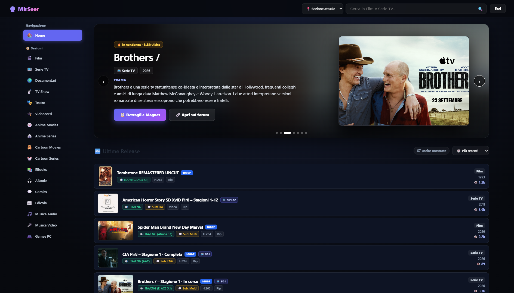
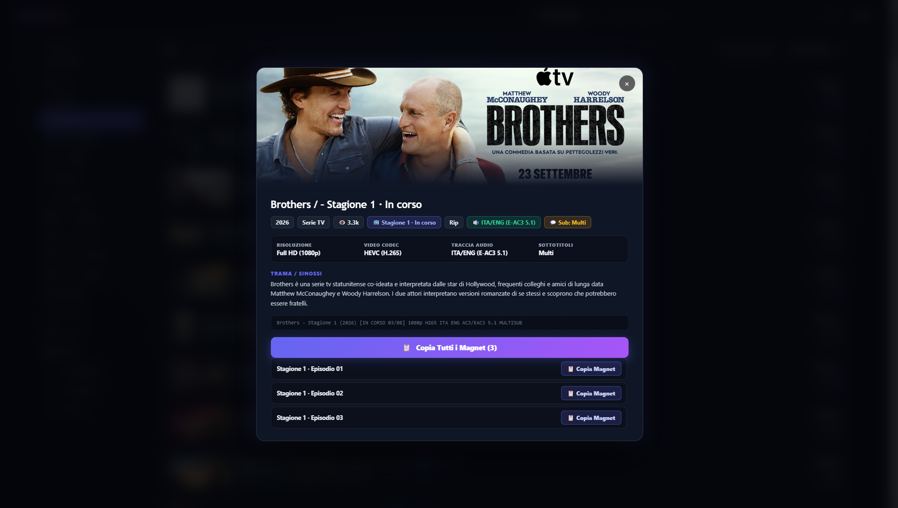

### Catalogo Multimediale di Nuova Generazione per MirCrew Releases

  Trasforma l'esperienza di navigazione forum in un'interfaccia VOD fluida, elegante e reattiva in stile Netflix/Prime Video, integrata direttamente nel tuo browser.

---

### ⚡ INSTALLAZIONE RAPIDA IN 1 CLIC

*(Richiede un userscript manager attivo: Tampermonkey, Violentmonkey)*

---

## 🖼️ Anteprima Interfaccia

  
  

---

## ✨ Funzionalità Principali
- 🎬 Interfaccia Cinema (Lista & Griglia)
Trasforma il forum in un vero e proprio catalogo in stile Netflix/Plex. Layout immersivo in modalità Dark (Glassmorphism), Hero Carousel per i titoli in tendenza e libertà di scegliere tra la visualizzazione a lista classica o la nuova Vista a Griglia per le sole locandine.
- 🍿 Metadati Avanzati, Voti & Trailer (Integrazione TMDb/IMDb)
Algoritmo intelligente che bypassa banner, userbar e firme dei releaser per estrarre i dati reali. Arricchisce i post con locandine in HD, trame ripulite, valutazioni medie, generi e ti permette di riprodurre i Trailer YouTube in un player a comparsa senza mai uscire dalla pagina.
- ⬇️ Automazione Torrent & WebUI Integrata
Gestione granulare dei Magnet link (episodio per episodio o intere stagioni). Oltre alla "Copia Rapida", ora puoi inviare i download direttamente a qBittorrent o Transmission con un clic, smistandoli automaticamente nelle tue cartelle di destinazione (es. /Media/Film o /Media/SerieTV).
- ⭐ Libreria Personale (Preferiti & Scaricati)
Tieni traccia delle tue preferenze senza limiti. Salva le release nella tua lista Preferiti per un accesso rapido e usa il marcatore visivo "Scaricato" (✓) per ricordarti cosa hai già inviato al tuo client torrent. Database locale ultra-veloce basato su IndexedDB.
- 🔍 Ricerca Universale & Filtri Rapidi
Motore di ricerca istantaneo (globale o per singola sezione) attivabile con scorciatoie da tastiera. Trova esattamente ciò che vuoi grazie ai Filtri Rapidi (facets) per isolare con un clic contenuti 4K UHD, HDR/Dolby Vision, Audio ITA o Stagioni Complete.

---

## 🚀 Guida all'Installazione

### Passo 1: Installa un Gestore Userscript
Scegli e installa l'estensione browser supportata in base al tuo sistema:

| Browser | Estensione Consigliata | Link Download |
| :--- | :--- | :--- |
| **Google Chrome / Brave** | Tampermonkey | [Chrome Web Store](https://chromewebstore.google.com/detail/tampermonkey/dhdgffkkebhmkfjojejmpbldmpobfkfo) |
| **Mozilla Firefox** | Tampermonkey | [Firefox Add-ons](https://addons.mozilla.org/it/firefox/addon/tampermonkey/) |
| **Microsoft Edge** | Tampermonkey | [Microsoft Edge Add-ons](https://microsoftedge.microsoft.com/addons/detail/tampermonkey/iikmkjmpaadaobahmlepeloendndfphd) |
| **Android (Kiwi / Firefox)** | Tampermonkey | Installabile dallo store del rispettivo browser |

### Passo 2: Installa lo Script
1. Clicca sul pulsante verde: **[INSTALLA MIRSEER ORA](https://raw.githubusercontent.com/amedeeee/MirSeer/main/mirseer.user.js)**
2. L'estensione aprirà automaticamente la schermata di verifica.
3. Clicca sul tasto **Installa** (o **Conferma installazione**).

### Passo 3: Utilizzo
1. Vai su [mircrew-releases.org](https://mircrew-releases.org) ed effettua l'accesso col tuo account.
2. In basso a destra comparirà il pulsante galleggiante circolare **🔮 MirSeer**.
3. Cliccaci sopra per aprire l'interfaccia catalogo.

---

## ⚙️ Configurazione TMDb (Opzionale)

MirSeer funziona nativamente senza chiavi esterne. Tuttavia, per abilitare i fondali ad alta risoluzione (Backdrop) e il recupero automatico della trama originale nei topic più datati, puoi inserire una API Key gratuita di TheMovieDatabase (TMDb):

1. Registra un account gratuito su [TheMovieDatabase (TMDb)](https://www.themoviedb.org/).
2. Vai su **Impostazioni > API** e genera una chiave personale (*API v3 auth*).
3. Apri la schermata impostazioni di MirSeer cliccando sull'icona ingranaggio ⚙️ dentro il catalogo.
4. Incolla la tua chiave nel campo **TMDb API Key** e clicca **Salva**.

---

## ❓ Domande Frequenti (FAQ) & Risoluzione Problemi

<b>Lo script rallenta o non estrae le copertine.</b>

Verifica che le estensioni AdBlocker (uBlock Origin, AdGuard) o firewall DNS (Pi-hole) non stiano bloccando host di immagini esterni (es. Postimages, ImgBB, TurboImageHost) spesso usati dai releaser.

<b>MirSeer funziona da smartphone?</b>

Sì! È sufficiente usare un browser mobile con supporto alle estensioni Chrome/Firefox come <b>Kiwi Browser</b> o <b>Firefox Mobile Nightly</b> con Tampermonkey installato.

<b>Come aggiorno lo script?</b>

Lo script si aggiorna in automatico in background ogni 24 ore. Per forzare l'aggiornamento immediato, apri la dashboard di Tampermonkey, individua "MirSeer" e seleziona <i>Operazioni > Verifica aggiornamenti</i>.

---

## 📄 Licenza

Distribuito sotto licenza **MIT**. Consulta il file [`LICENSE`](LICENSE) per ulteriori dettagli.

  Realizzato per la community con dedizione e codice pulito. MirSeer non ospita file protetti da copyright: si limita a organizzare i metadati pubblici del forum.

